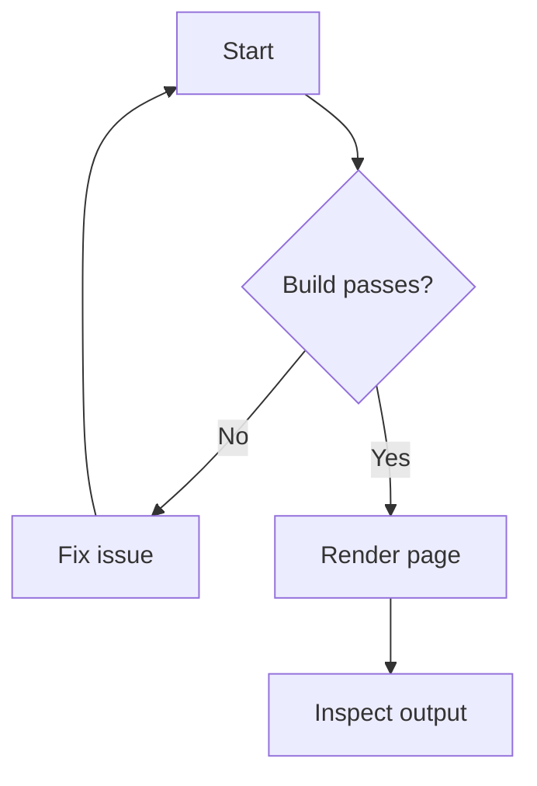
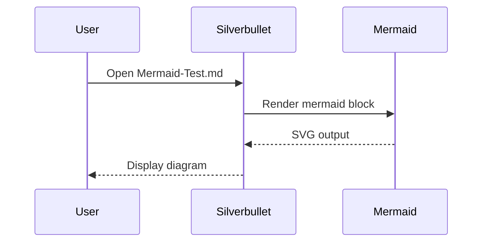
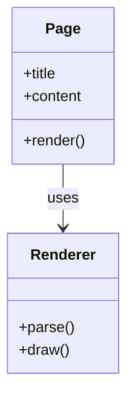
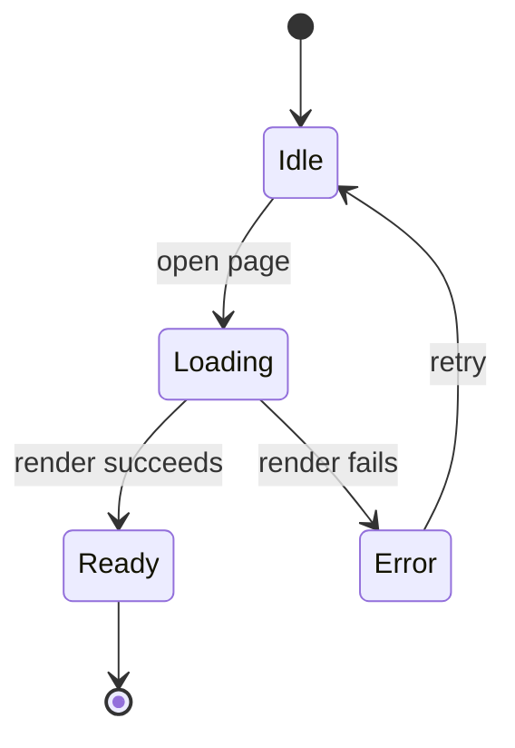
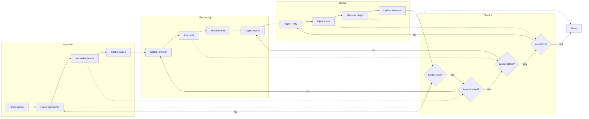
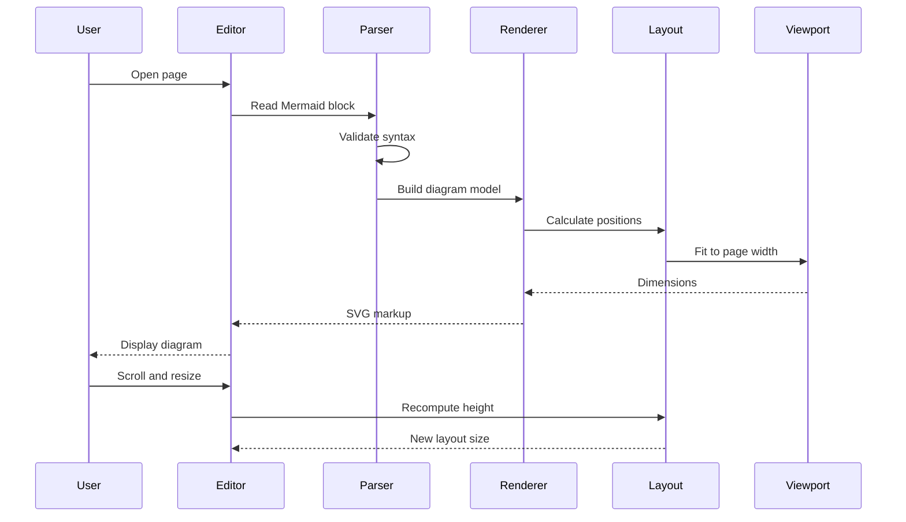

# Mermaid Test

This page is meant to verify that Silverbullet renders Mermaid diagrams correctly.

If everything is working, each diagram below should render as a diagram instead of showing raw code fences.

## Flowchart

## Sequence Diagram

## Class Diagram

## State Diagram

## Large Graph

## Dense Sequence

## What to Check

- Flowchart nodes should have arrows and decision branches.
- Sequence diagram should show participants and message arrows.
- Class diagram should show labeled relationships.
- State diagram should show transitions and terminal states.
- The large graph should create more layout work and be visibly denser.
- The dense sequence should help reveal any slow redraw or sizing issues.
- If any block stays as plain text, Mermaid rendering is not working.
